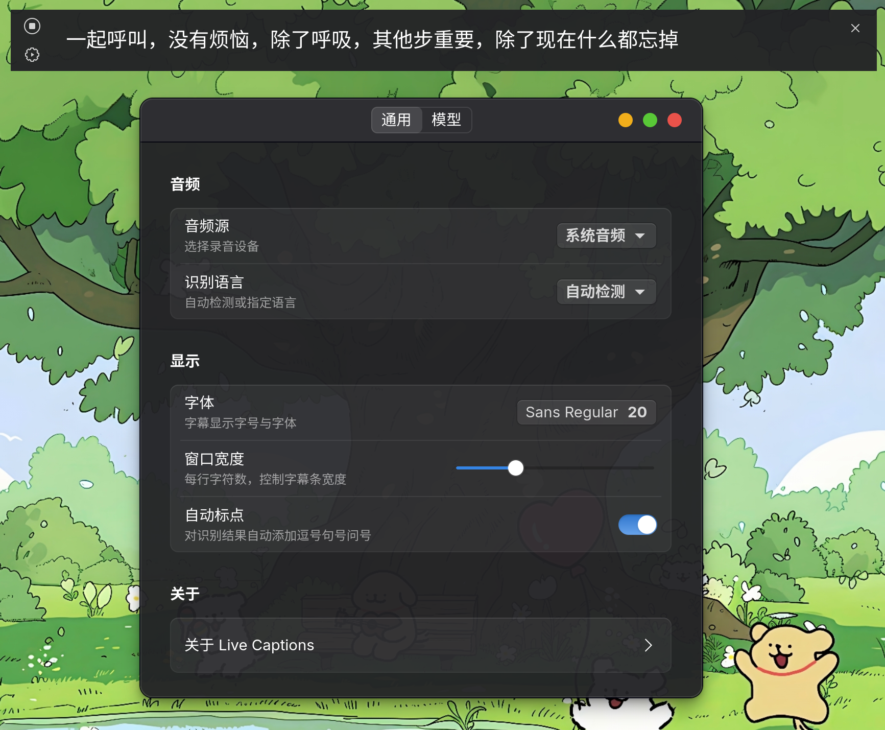

# Live Captions GTK

实时语音转字幕的 GTK 桌面应用

> 基于 sherpa-onnx 流式语音识别引擎，支持麦克风和系统音频捕获，以浮动字幕条形式在桌面上实时显示识别文本。

## 截图



> *浮动字幕窗口与设置*

## 功能

- 🎙️ **双音频源**：麦克风输入 / 系统音频输出（monitor source）
- 🔄 **智能后端**：自动选择 PipeWire → PulseAudio → ALSA
- 🧠 **多模型支持**：Zipformer / Paraformer 流式识别
- 🌏 **中英双语**：支持中文、英文及混合识别
- ✏️ **自动标点**：可选 CT-Transformer 标点恢复模型
- 🎨 **浮动字幕**：无边框、半透明背景、平滑过渡动画
- ⚙️ **可配置**：字体、窗口宽度、音频源、标点开关

## 快速开始

### 从 Release 下载

1. 从 [Releases](https://github.com/your-username/live-captions-gtk/releases) 下载最新 `live-captions-gtk-x86_64-linux.tar.gz`
2. 解压并运行：

   ```bash
   tar xzf live-captions-gtk-x86_64-linux.tar.gz
   ./live-captions-gtk
   ```

### 自行编译

```bash
# 安装依赖（Arch Linux）
sudo pacman -S gtk4 libadwaita pipewire pulseaudio

# 安装依赖（Ubuntu/Debian）
sudo apt install libgtk-4-dev libadwaita-1-dev libpulse-dev libpipewire-0.3-dev libspa-0.2-dev

# 编译运行
cargo run --release
```

### 下载模型

首次启动后，打开设置 → 模型页面，在下载列表中选择需要的模型点击下载即可。

## 架构

```txt
音频设备 (cpal) → 环形缓冲区 → ASR 引擎 (sherpa-onnx) → 标点恢复 → GTK4 字幕窗口
```

## 许可证

本项目基于 **MIT 许可证**，详见 [LICENSE](LICENSE)。

### 使用的模型

| 模型 | 说明 |
| -- | --- |
| [sherpa-onnx-streaming-zipformer-zh-int8-2025-06-30](https://huggingface.co/csukuangfj/sherpa-onnx-streaming-zipformer-zh-int8-2025-06-30) | 流式 Zipformer 中文识别 (int8, ~160MB) |
| [sherpa-onnx-streaming-paraformer-bilingual-zh-en](https://huggingface.co/csukuangfj/sherpa-onnx-streaming-paraformer-bilingual-zh-en) | 流式 Paraformer 中英双语识别 (int8, ~226MB) |
| [sherpa-onnx-punct-ct-transformer-zh-en-vocab272727-2024-04-12-int8](https://github.com/k2-fsa/sherpa-onnx/releases/tag/punctuation-models) | CT-Transformer 中英标点恢复 (int8, 72MB) |

### 使用的开源库

| 库 | 许可证 |
| --- | --- |
| [sherpa-onnx](https://github.com/k2-fsa/sherpa-onnx) | Apache 2.0 |
| [cpal](https://github.com/RustAudio/cpal) | Apache 2.0 |
| [GTK4](https://gitlab.gnome.org/GNOME/gtk) | LGPL 2.1 |
| [libadwaita](https://gitlab.gnome.org/GNOME/libadwaita) | LGPL 2.1 |
| [hf-hub](https://github.com/8bitAgency/hf-hub) | MIT |
